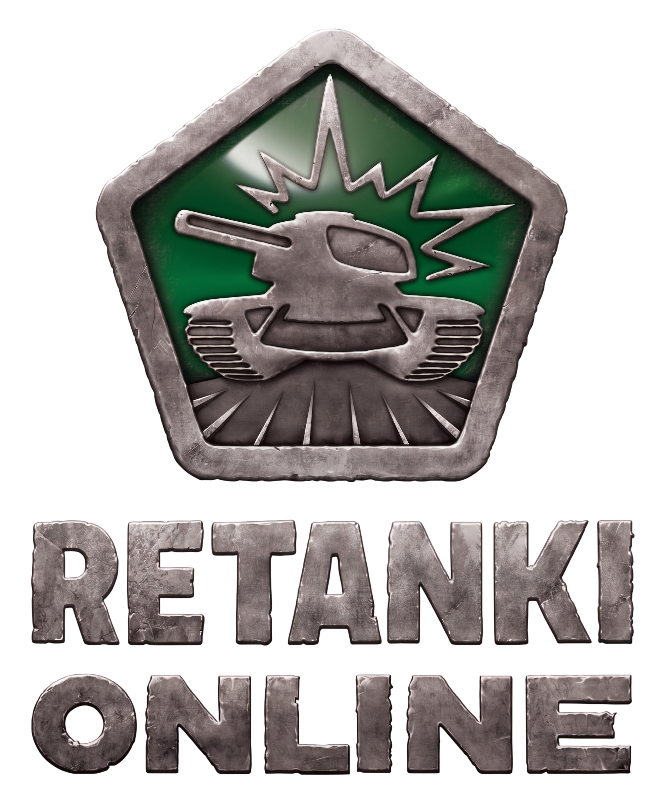
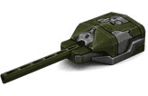
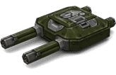
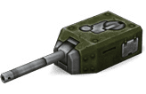
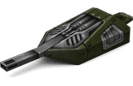
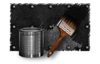
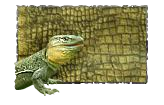
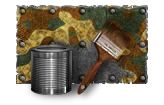
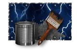

  
  
  # ReTanki Online
  
  **Многопользовательский 3D-экшен на WebGL, физике Rapier3D и сетевой архитектуре WebSocket.**
  
  
  
  
  
  

---

## 📖 О проекте

ReTanki Online — веб-реинкарнация классического танкового браузерного экшена золотой эпохи 2010–2014 годов. Проект разработан на базе современного стека технологий без применения Flash и сторонних плагинов, запускаясь прямо в браузере с поддержкой десктопных платформ.

Ключевые инженерные решения:
* Физически корректная симуляция танкового шасси на базе детерминированного физического движка Rapier3D с многолучевой raycast-подвеской (12 независимых лучей).
* Модульная баллистическая и лучевая система орудий (мгновенный raycast, отскоки рикошета, снайперский режим с накопительным зумом, конусный потоковый урон).
* Продвинутый кастомный PBR-шейдер красок с поддержкой трипланарного проецирования (Triplanar Mapping), запеченных лайтмапов окклюзии, альфа-детализации и процедурного загрязнения корпуса в реальном времени.
* Авторитарная архитектура сервера на WebSockets с репликацией состояний (World Snapshots) и клиентской интерполяцией движения.

---

## 🖼 Превью вооружения и камуфляжей

### Вооружение и модификации (M0–M3)
| Рельса M1 | Твинс M1 | Смоки M1 | Огнемёт M1 |
| :---: | :---: | :---: | :---: |
|  |  |  |  |

### Покрытия и текстуры красок
| Чёрный | Дракон | Флора | Зевс |
| :---: | :---: | :---: | :---: |
|  |  |  |  |

---

## 1. Архитектура графического конвейера (Рендер)

Графическая подсистема построена на связке Renderer.ts, MapLoader.ts и GarageScene.ts. Основная задача — воспроизвести визуальную атмосферу классических танковых баталий без артефактов пересвета и с минимальной нагрузкой на GPU.

    +-------------------------------------------------------------------------+
    |                        Three.js Scene Graph                             |
    +--------------------------------+----------------------------------------+
    |   Освещение и Тени             |   Камера и Атмосфера                   |
    |   * AmbientLight (Рассеянный)  |   * PerspectiveCamera (FOV 56° / Zoom) |
    |   * HemisphereLight (Скайлайт) |   * FogExp2 / Линейный туман           |
    |   * DirectionalLight (Солнце)  |   * Alternativa3D Lag Controller       |
    |   * PCFSoftShadowMap           |   * Raycast Camera Collision           |
    +--------------------------------+----------------------------------------+
                                     |
                                     v
    +-------------------------------------------------------------------------+
    |                 WebGLRenderer (Color Pipeline)                          |
    +-------------------------------------------------------------------------+
    |  * outputColorSpace = SRGBColorSpace (Защита от выцветания текстур)     |
    |  * toneMapping = ACESFilmicToneMapping                                  |
    |  * toneMappingExposure = 1.1                                            |
    |  * shadowMap.bias = -0.001 (Устранение Shadow Acne)                     |
    +-------------------------------------------------------------------------+

### 1.1. Цветовой пайплайн и защита текстур
В стандартном WebGL при работе с PBR-материалами диффузные карты склонны выгорать в белый цвет. Для стабильности цветопередачи:
* Выходное цветовое пространство зафиксировано в THREE.SRGBColorSpace.
* Включен тонемаппинг THREE.ACESFilmicToneMapping с экспозицией 1.1. Это сохраняет сочность пиксельных паттернов красок и контраст металлических элементов.

### 1.2. Освещение и динамические тени
* Солнце (DirectionalLight): интенсивность 1.4, теплый спектр 0xfff6e6. Источник перемещается синхронно с танком игрока (sun.position.set(tankPos.x + 35, 70, tankPos.z - 25)), сохраняя фокус карты теней 2048x2048 в ортографическом объеме sDist = 80.
* Рассеянный свет: связка AmbientLight (0.6) и HemisphereLight (небо 0xcde1f5, земля 0x443a2f, интенсивность 0.6) подсвечивает днище и скрытые углы без абсолютной темноты.
* Устранение артефактов: смещение тени shadow.bias = -0.001 устраняет рябь самозатенения, а PCFShadowMap смягчает контуры силуэтов.

### 1.3. Контроллер боевой камеры (Alternativa3D Lag)
* Двухосевая задержка (Lag):
  posLerp = 1.0 - exp(-posLagSpeed * dt)
  rotLerp = 1.0 - exp(-rotLagSpeed * dt)
  Камера плавно отрабатывает рывки корпуса при отдаче и перепадах рельефа.
* Кастер коллизий камеры: во избежание проваливания сквозь геометрию карты из целевой точки танка пускается луч Rapier (world.castRay). При наличии преграды дистанция отсекается:
  finalDistance = max(1.6, hitToi - 0.45)
* Зум: колесо мыши масштабирует базовую дистанцию (14.5м) и высоту (5.6м) в диапазоне от 0.45x до 2.2x.

---

## 2. Шейдерный пайплайн и система материалов (Custom PBR Shader)

Отрисовка брони в ReTanki Online реализована через инжекцию GLSL-кода в стандартный пайплайн Three.js (AssetLoader.ts -> createArmorMaterial на хуке onBeforeCompile). Шейдер динамически комбинирует пять независимых текстурных слоев:

                      +------------------------------+
                      |   1. Паттерн краски (UV)     |
                      |   или Triplanar проецирование|
                      +--------------+---------------+
                                     |
                                     v
    +-------------------------+  Смешивание   +-------------------------+
    | 2. Лайтмап (Lightmap)   | ------------> | 3. Слой деталей (Alpha) |
    | Запечённая окклюзия     |               | Швы, заклёпки, решётки  |
    +-------------------------+               +------------+------------+
                                                           |
                                                           v
                                              +-------------------------+
                                              | 4. Процедурная грязь    |
                                              | Маска высоты Y + Noise  |
                                              +------------+------------+
                                                           |
                                                           v
                                              +-------------------------+
                                              | Итоговый PBR-материал   |
                                              | Roughness + Metalness   |
                                              +-------------------------+

### Технические особенности реализации:
1. Двойной режим маппинга (uMappingMode):
   * UV Mode (0): текстура масштабируется параметром uPaintScale, вращается 2D-матрицей rotMat вокруг центра (0.5, 0.5) с индивидуальным скаляром башни uTurretScaleMult.
   * Triplanar Mode (1): текстура проецируется по осям X, Y, Z с весовым блендингом на базе нормалей pow(abs(vLocalNormal), vec3(4.0)), что исключает растяжения на острых скосах носа и масках пушек.
2. Лайтмаппинг (uLightmap): запеченная карта окклюзии умножает базовый цвет брони (diffuseColor.rgb *= lm.rgb * 1.32), создавая естественные тени в углублениях геометрии без просадки FPS.
3. Сохранение микрорельефа (uDetailsMap): слой деталей содержит альфа-канал с болтами, люками и решетками радиатора. Шейдер накладывает их поверх базовой краски через mix(paintedArmor, det.rgb, det.a).
4. Процедурное загрязнение гусеничной зоны: шейдер считывает высоту вертекса vModelPos.y. Нижняя зона корпуса затемняется и покрывается процедурным шумом грязи vec3(0.18, 0.14, 0.10) с коэффициентом fract(sin(dot(...))) * uMudStrength.
5. Динамическая калибровка в реальном времени: параметры uPaintScale, uPaintAngle, uMudStrength, paintRoughness и paintMetalness обновляются мгновенно через updateLivePaintTuning() без перекомпиляции материалов.

---

## 3. Физический движок и симуляция шасси (Rapier3D)

Физика танка (TankPhysicsController.ts) построена на детерминированном твердом теле Rapier3D с многолучевой подвеской (Raycast Suspension) на 12 независимых лучах (по 6 на борт).

              [Корпус Танка: Динамическое тело Rapier]
                          |          |
       +------------------+----------+------------------+
       |                                                |
       v (Ray 1..6: Левый борт)         v (Ray 7..12: Правый борт)
    +------+ +------+ +------+       +------+ +------+ +------+
    |  \   | |  |   | |   /  |       |  \   | |  |   | |   /  |
    +---+--+ +---+--+ +---+--+       +---+--+ +---+--+ +---+--+
        |        |        |              |        |        |
        v        v        v              v        v        v
    ================== [ Поверхность Арены (Trimesh) ] ==================

### 3.1. Математика лучевой подвески (Закон Гука с демпфированием)
Каждый луч выпускается из локальной точки крепления подвески вниз:
1. Расчет сжатия виртуальной пружины:
   compression = max(0, suspensionRestLength - dist)
2. Расчет скорости сжатия вдоль направления луча:
   springSpeed = pointVelocity.dot(rayDirection)
3. Расчет результирующей силы:
   suspensionForce = max(0, (compression * suspensionStiffness) + (springSpeed * suspensionDamping))
4. Сила прикладывается в точке контакта через applyImpulseAtPoint. Передние и задние лучи разведены под углами (30° и 25°), что позволяет преодолевать вертикальные уступы и заезжать на крутые рампы.

### 3.2. Тяга и боковое сцепление
* Продольная тяга (Drive): тяговое усилие двигателя проецируется на нормаль поверхности под гусеницей и распределяется между лучами, находящимися в контакте с грунтом.
* Подавление бокового дрифта: для имитации гусеничного сцепления вычисляется поперечная скорость точки контакта. Прикладывается компенсирующий импульс противодействия заносу. При активном повороте (turnInput != 0) сцепление снижается до 0.25 для управляемого скольжения кормы.
* Разворот на месте (Neutral Steering): при отсутствии нажатия W/S борта получают противоположно направленные силы тяги, а шасси получает угловой импульс applyTorqueImpulse вокруг вертикальной оси.

### 3.3. Составные хитбоксы и синхронизация башни
* Коллайдер шасси (chassisCollider): прямоугольный параллелепипед, рассчитанный по габаритам корпуса со смещенным вниз центром масс для устойчивости.
* Коллайдер башни (turretCollider): независимый коллайдер, жестко привязанный к шасси. При вращении башни (turretYaw) коллайдер синхронизирует свою позицию и ориентацию в локальном пространстве родительского тела (setTranslationWrtParent, setRotationWrtParent), обеспечивая честную регистрацию попаданий при стрельбе в повернутую башню.

---

## 4. Боевая система и баллистика орудий (WeaponManager)

Файл WeaponManager.ts реализует расчет баллистики, таймингов, отдачи и статус-эффектов для 9 типов пушек, разделенных на три класса.

                                WeaponManager
                                      |
             +------------------------+------------------------+
             v                        v                        v
     1. Мгновенный луч        2. Потоковый конус        3. Физический снаряд
     (Hitscan Raycast)        (Cone Trace & Stream)     (Bouncing Projectile)
     * Smoky (Крит)           * Firebird (Догорание)    * Twins (Спам плазмой)
     * Railgun (Пробитие)     * Freeze (Заморозка)      * Ricochet (Отскоки)
     * Thunder (Сплеш)        * Isida (Вампиризм)
     * Shaft (Снайперка)

### 4.1. Импульсное и хитскан-вооружение
* Smoky: мгновенный луч. Расчет вероятности крита (critChance = 0.25, множитель 2.8x). При критическом выстреле проигрывается smoky_exp.mp3, спавнится critical_hit.png, а цель получает двойной физический импульс отдачи.
* Railgun: задержка выстрела (chargeTime = 1.1с) с анимацией вращающихся спиралей накопления энергии. Выстрел пробивает неограниченное число танков насквозь по линии трассировки (piercedTanks.add(victim.id)) и останавливается только о геометрию карты.
* Thunder: разрывной снаряд. Точка попадания луча провоцирует радиальный взрыв со сплешем (splashRadius = 8.5м). Все танки в радиусе получают урон с линейным спадом от эпицентра и разлетаются в стороны от ударной волны.
* Shaft: два режима ведения огня:
  - Аркадный: быстрый клик пробела для выстрела навскидку со стандартным уроном.
  - Снайперский: удержание пробела более 0.16с переключает камеру в оптический режим со снижением FOV (с 56° до 16°). Включается лазерная указка трассировки. Урон накапливается пропорционально времени заряда от 450 до 1300 единиц с отдачей до 17000 Н*с.

### 4.2. Потоковое оружие ближнего боя
Использует баллонную шкалу энергии (energy) и конусную проверку попаданий (applyConeDamage).
* Firebird: выпускает спрайтовые частицы огня. Накладывает эффект догорания (burnTimer = 5.0с), в течение которого цель теряет здоровье, а корпус раскаляется оранжевым свечением.
* Freeze: струя хладагента. Накладывает статус обледенения (freezeRatio), снижая максимальную скорость, маневренность шасси и скорость перезарядки орудия цели вдвое.
* Isida: пространственный выбор приоритетной цели по вектору прицеливания. При захвате союзника восстанавливает очки прочности, при захвате врага — наносит урон и восстанавливает стрелку 50% от нанесенного урона (вампиризм).

### 4.3. Снарядное оружие с рикошетом
* Twins: поочередная скорострельная стрельба плазменными зарядами из двух стволов со скоростью 48 м/с без баллистического падения.
* Ricochet: снаряды со скоростью 42 м/с. При столкновении с препятствиями вектор отражения вычисляется через нормаль плоскости (V_reflected = V - 2 * (V.dot(N)) * N). Снаряд сохраняет урон до 2 отскоков от стен и пола.

### 4.4. Математика модификаций M0–M3
Характеристики не дублируются в отдельных таблицах, а динамически масштабируются через множители MOD_MULTIPLIERS:
* M0: x1.00
* M1: x1.15
* M2: x1.35
* M3: x1.60

Метод applyModifications(combatant, hullMod, turretMod) пересчитывает:
* Максимальное здоровье: newMaxHp = mass * 1.2 * hullMultiplier с сохранением текущего процента прочности.
* Наносимый урон: baseDamage * damageMultiplier.
* Скорость перезарядки: шаг таймера делится на множитель модификации, увеличивая темп стрельбы.

---

## 5. Сетевой стек и серверная авторитарность

Сетевое взаимодействие построено на библиотеке ws без тяжелых надстроек с обменом пакетами по протоколу WebSocket.

     [Клиент 1]                    [Сервер: Room.ts]                   [Клиент 2]
          |                                |                                |
          +--- c_state (25 раз/сек) ------>|                                |
          |    [x, y, z, rot, turretYaw]   |                                |
          |                                +--- s_world_snapshot ---------->|
          |                                |    (Интерполяция LERP/SLERP)   |
          |                                |                                |
          +--- c_shot -------------------->+--- s_shot_fired -------------->|
          |    [weapon, dir, hitPoint]     |    [Спавн трассера и звука]    |
          |                                |                                |
          +--- c_equip_change ------------>+--- s_equip_change ------------>|
          |    [hull, turret, M0-M3]       |    [Пересоздание RemoteTank]   |

### 5.1. Репликация и интерполяция движения
* Клиент отправляет состояние шасси c_state с частотой физического тика.
* Сервер агрегирует состояния и транслирует снимок мира s_world_snapshot 25 раз в секунду.
* RemoteTank.ts применяет экспоненциальное сглаживание во избежание сетевых рывков:
  visualPos.lerp(targetPos, 1.0 - exp(-22.0 * dt))
  visualQuat.slerp(targetQuat, 1.0 - exp(-22.0 * dt))
* Кинематическое тело Rapier удаленного танка перемещается синхронно со сглаженной сеткой, гарантируя регистрацию тарана и коллизий выстрелов.

### 5.2. Синхронизация оборудования на лету
При смене пушки, корпуса или грейда (M0–M3) в меню клиент отсылает c_equip_change. Сервер обновляет запись игрока в ConnectedPlayer и рассылает s_equip_change. Клиенты на лету удаляют старый экземпляр RemoteTank и пересоздают его с актуальными мешами и коллайдерами.

---

## 6. Интерактивная среда, припасы и дропы

Подсистема DropBoxManager.ts воспроизводит поведение серверных дропов на арене:
* Серверный таймер спавна: каждые 12 секунд сервер Room.ts находит свободную зону и отсылает пакет s_box_spawn.
* Парашютная физика: ящик спускается с высоты 20м со скоростью 3.4 м/с с синусоидальным покачиванием купола. При достижении пола (BASE_FLOOR_Y = 5.95) купол отсоединяется и удаляется из сцены.
* Золотой ящик: активируется по клавише G или таймеру. Включается сирена goldbox_siren.mp3, выводится баннер в HUD, а на асфальте спавнится предупреждающая золотая декаль зоны сброса.
* Противотанковые мины: установка по клавише 5 с таймером взведения (1.2с) и подрывом при приближении любого вражеского танка (урон 1400–1800 HP с вертикальным подбрасывающим импульсом).

---

## 📂 Структура репозитория и назначение файлов

    retanki-reborn/
    ├── client/                      # Клиентское веб-приложение
    │   ├── src/
    │   │   ├── audio/
    │   │   │   └── AudioManager.ts  # Звуковой движок: позиционирование, полифония, зацикливание мотора
    │   │   ├── combat/
    │   │   │   ├── DropBoxManager.ts# Логика и визуал падающих ящиков припасов и голда
    │   │   │   └── WeaponManager.ts # Баллистика, расчёт урона, множители M0-M3, потоковый огонь
    │   │   ├── graphics/
    │   │   │   ├── AssetLoader.ts   # Загрузка .glb, кастомные шейдеры брони и гусениц
    │   │   │   ├── GarageScene.ts   # Изолированная сцена ангара, свет, вращение платформы
    │   │   │   ├── MapLoader.ts     # Загрузка карты, коллизий и атмосферы (туман, свет)
    │   │   │   ├── Renderer.ts      # Сцена Three.js, параметры камеры, тени солнца
    │   │   │   ├── SpriteSheetCutter.ts # Нарезка атласов анимаций на кадры на Canvas
    │   │   │   └── VFXManager.ts    # Пул анимированных билбордов (взрывы, вспышки, дым)
    │   │   ├── network/
    │   │   │   └── NetworkManager.ts# WebSocket клиент, сериализация и десериализация сетевых пакетов
    │   │   ├── physics/
    │   │   │   ├── RemoteTank.ts    # Интерполяция и физический прокси удалённых танков
    │   │   │   ├── SpawnManager.ts  # Парсинг точек возрождения и безопасная посадка на грунт
    │   │   │   └── TankPhysicsController.ts # Физика шасси Rapier, пружины, тяга, сцепление
    │   │   ├── ui/
    │   │   │   ├── BattleHUD.ts     # Боевой интерфейс: шкалы HP, баллон, перезарядка, киллфид
    │   │   │   ├── GarageUI.ts      # Интерфейс выбора и прокачки корпусов, пушек и красок
    │   │   │   └── ZoneEditorUI.ts  # Внутриигровой визуальный редактор зон дропа (F4 / ~)
    │   │   └── main.ts              # Точка входа клиента, обработка ввода и главный тик-луп
    ├── server/                      # Авторитарный WebSocket сервер
    │   └── src/
    │       ├── core/
    │       │   └── Room.ts          # Состояние битвы, синхронизация игроков, спавн дропа, снапшоты
    │       └── index.ts             # Сетевой сервер, приём соединений, обработка сброса зон
    └── shared/                      # Общие типы данных и сетевые контракты
        ├── constants.ts             # Базовые ТТХ вооружения и корпусов
        └── types.ts                 # Сетевые пакеты (ClientBattleMessage, ServerBattleMessage)

---

## 🛠 Руководство по разработке

### 1. Добавление новой пушки
1. В shared/constants.ts и WeaponManager.ts внесите базовые характеристики в WEAPON_CONFIGS (reloadTime, minDamage, maxDamage, range, recoilForce).
2. В AssetLoader.ts добавьте алиасы папок и моделей в метод getFolderAliases.
3. В WeaponManager.ts свяжите вызов выстрела в executeDischarge (для лучевых — executeRaycastShot, для плазмы — firePlasmaProjectile, для струй — handleStreamWeapon).
4. В NetworkManager.ts пропишите обработку визуала выстрела соперника в renderRemoteShot.

### 2. Балансировка модификаций (M0–M3)
Характеристики модификаций рассчитываются на основе базовых параметров и коэффициентов MOD_MULTIPLIERS в WeaponManager.ts:
* M0: x1.00
* M1: x1.15
* M2: x1.35
* M3: x1.60

Метод applyModifications(combatant, hullMod, turretMod) автоматически пересчитывает:
* Здоровье танка: baseMass * 1.2 * hullMultiplier с сохранением текущего процента прочности.
* Наносимый урон: baseDamage * damageMultiplier.
* Скорость перезарядки: интерполированное время восстановления циклов.

---

## 8. Установка, запуск и управление

### Шаг 1: Установка зависимостей
    npm install

### Шаг 2: Запуск сервера авторизации
    npm run dev:server

### Шаг 3: Запуск клиента разработки
    npm run dev:client

### Шаг 4: Остановка проекта
    Ctrl + C

### Раскладка управления:
* W / S (Стрелки Вверх / Вниз): движение вперед / назад.
* A / D (Стрелки Влево / Вправо): поворот корпуса.
* Z / X: вращение башни влево / вправо.
* C: центрирование башни по направлению корпуса.
* Пробел (Space): огонь / вход в снайперский зум (Шафт).
* 1 — 5: использование расходников (Аптечка, Броня, ДД, Нитро, Мина).
* G: сброс Золотого ящика.
* R: самовозврат (восстановление перевернутого танка на гусеницы).
* H: включение/выключение визуализации хитбоксов и лучей подвески.
* F4 / Ё (~): открытие встроенного редактора зон и параметров тюнинга.

---

## 9. Дорожная карта проекта (Roadmap)

### Завершённые этапы:
* Физический фундамент шасси:
  - Симуляция лучевой подвески на 12 лучах с независимым сжатием и демпфированием.
  - Расчёт продольного и поперечного сцепления гусениц с грунтом при заносе и развороте на месте.
* Боевой арсенал (9 типов орудий):
  - Smoky: мгновенный луч с расчётом шанса и множителя критического урона.
  - Railgun: задержка выстрела, фаза зарядки, пробитие нескольких танков насквозь.
  - Thunder: расчёт сплеш-урона с линейным падением силы импульса от эпицентра.
  - Twins / Ricochet: физические снаряды с детекцией коллизий и отскоками от препятствий.
  - Shaft: аркадный режим стрельбы навскидку и снайперский зум-режим с накоплением энергии.
  - Firebird / Freeze / Isida: потоковый расчёт конусного урона с наложением статусов догорания, заморозки и вампиризма.
* Синхронизация модификаций M0–M3:
  - Динамическая загрузка геометрии пушек и корпусов для конкретного грейда.
  - Корректный пересчёт HP, урона и кулдаунов при смене оборудования прямо на арене.
* Игровая среда и дропы:
  - Синхронизированный серверный спавн припасов на парашютах (Аптечка, Броня, ДД, Нитро).
  - Сброс Золотого ящика с сиреной, предупреждением в HUD и фиксацией подбора.
  - Установка и подрыв контактных противотанковых мин.
* Визуальный стек:
  - Кастомный шейдер краски с трипланарным наложением, лайтмапами и процедурной маской грязи.
  - Система партиклов на анимированных спрайт-листах (взрывы, дульное пламя, выгорание).

### Текущий этап разработки:
* Серверная валидация попаданий (Server-side Hitreg):
  - Перенос расчёта лучей и коллизий снарядов на серверную копию мира Rapier.
  - Авторитарная фиксация урона для предотвращения клиентских модификаций данных.
* Оптимизация сетевого протокола:
  - Переход от строковых JSON-пакетов к компактным бинарным буферам (ArrayBuffer / TypedArray).
  - Дельта-компрессия координат и квантование кватернионов поворота.

### Запланировано на будущее:
* Игровые режимы:
  - Team Deathmatch (TDM): разделение на команды, командный баланс.
  - Capture The Flag (CTF): физическая сущность флага, механика возврата и доставки.
  - Control Points (CP): динамический захват территорий.
* Постоянный профиль игрока:
  - Интеграция базы данных (PostgreSQL / Redis) для сохранения кристаллов, гаража и рангов.
  - Аутентификация через JWT-токены.
* Чат и социальные функции:
  - Боевой и общий командный чат с фильтрацией спама.
  - Система кланов, рейтингов и послематчевая таблица статистики.

---

## ⚖️ Лицензия и правовая информация

Код проекта распространяется под лицензией MIT. 

Проект ReTanki Online создаётся независимым сообществом исключительно в некоммерческих, исследовательских и образовательных целях. Все права на товарные знаки, оригинальные визуальные концепты, 3D-модели, текстуры и аудиоряд принадлежат компании Alternativa Games.

